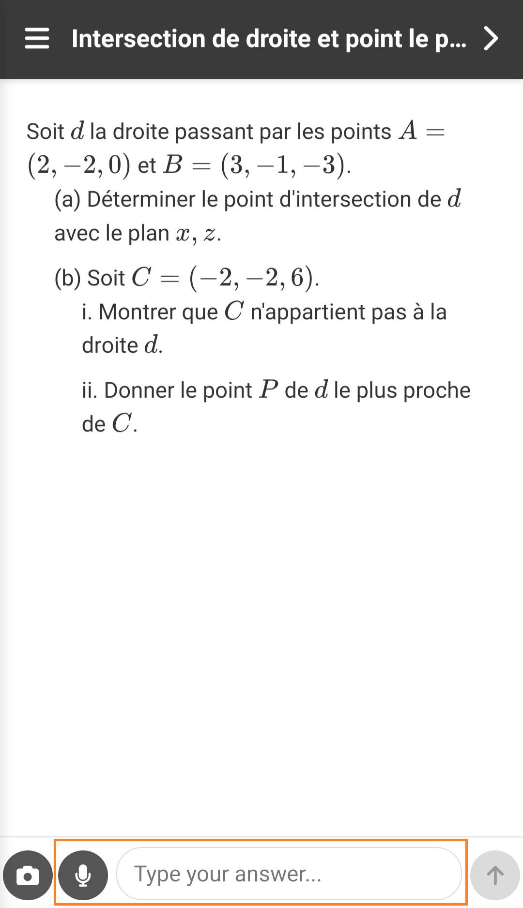
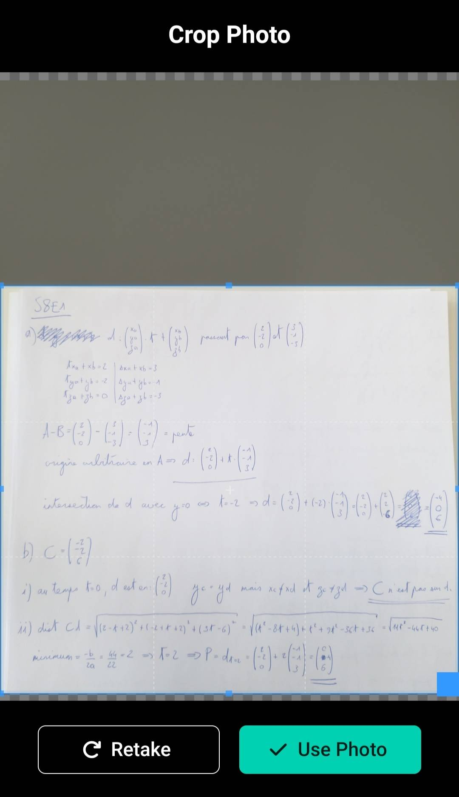
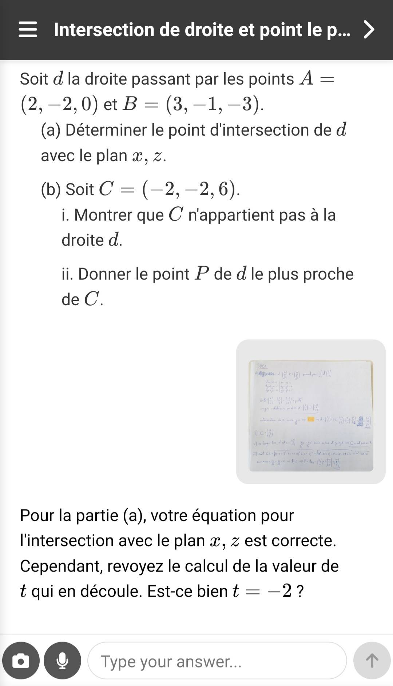

# STeacher usage (math version)
When you select an exercise, you'll be greeted with the exercise instructions at the top of the conversation.

## Text input
You can either speak with the microphone option or use the textbox to input text to STeacher. Try and use the correct vocabulary to help the model understand your query, but it's not vital to the model's functionning, it will do its best to understand and help you either way.

To use the microphone, press the microphone button in the bottom left, speak and hold it until you're done talking, then release it. Your audio will then be transformed into text and shown in the textbox for verification.

***

## Image input
You can input your image with the camera button in the bottom left. You will be able to import a picture from your local files or take one directly. Once your picture is taken, you'll also have access to a crop option to select only the part you want to send to STeacher.

## Input good use
The image is the most important part of your input:
1. Upload one image at a time
2. Try to take a clean picture (clear, no obstacles, sufficient light)
3. Use the cropping to isolate your sheet: Your math exercise should be the only thing in the picture

It is perfectly fine to input no text if you don't have a comment about your work. If you have a specific question about the exercise or additionnal context the tool should have to be able to help you, then please use the text input to give said question/context.

It is also perfectly fine to input no image if you want to discuss a point with the model, respond to a question, etc.

***

## Model response
The model response might take a bit of time to arrive, typically 20-25s. It will contain a guidance text and slightly modify the image you sent if there is one.

If there was an error in your sheet and/or the model found useful to, it will highlight a part of your page in orange. Check this highlighting before reading the model's guidance, as it should be placed around the math the model wants to get your attention to.

## This is a beta
Keep in mind that this tool is **actively being tested** (with you, thank you!). The model might occasionnaly misread your image or hallucinate, always take what it tells you with a grain of salt. If the model wasn't helpful/clear after a few tries, please go to a human teacher for guidance with your exercise and report anything weird to M. Richardet for debugging.

